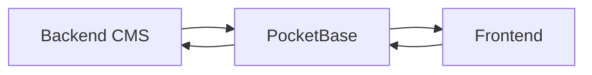

# E-commerce Unified Project

A complete e-commerce solution with a customer-facing storefront (Frontend) and an admin management system (Backend CMS), both powered by PocketBase.

## 🏗️ Project Architecture

```
Merge/
├── Frontend/           # Customer-facing e-commerce storefront
│   ├── src/           # React frontend source
│   └── src/server/    # Razorpay payment server
├── Backend CMS/       # Admin panel for managing orders, products, etc.
│   ├── src/           # React admin panel source
│   └── src/server/    # Email notification server
└── PocketBase/        # Shared database (to be set up)
```

## 🔗 How They Work Together

Both applications share the **same PocketBase database**, which means:

1. **Products**: When you add/edit a product in the Backend CMS, it immediately appears in the Frontend
2. **Orders**: Orders placed in the Frontend appear instantly in the Backend CMS for processing
3. **Users**: User accounts are shared across both systems
4. **Inventory**: Stock updates in CMS reflect immediately on the Frontend

### Data Flow Example
```
Customer (Frontend) → Places Order → PocketBase Database
                                           ↓
Admin (Backend CMS) ← Sees New Order ← PocketBase Database
       ↓
Updates Product Variant/Stock
       ↓
PocketBase Database → Updates Frontend → Customer Sees Changes
```

## 🚀 Quick Start

### Prerequisites

- Node.js (v16 or higher)
- npm or yarn
- PocketBase ([Download here](https://pocketbase.io/docs/))

### 1. Install Dependencies

```bash
# Install root dependencies
npm install

# Install all project dependencies
npm run install:all
```

### 2. Setup PocketBase (One-time Setup)

1. **Download PocketBase**
   - Download from https://pocketbase.io/docs/
   - Extract to a `PocketBase` folder in the root directory

2. **Start PocketBase**
   ```bash
   cd PocketBase
   ./pocketbase serve
   ```
   
   Or on Windows:
   ```bash
   cd PocketBase
   pocketbase.exe serve
   ```

3. **Create Admin Account**
   - Open http://127.0.0.1:8090/_/
   - Create an admin account
   - Save these credentials!

4. **Initialize Collections**
   ```bash
   # From the Frontend directory
   cd Frontend
   npm run init:pocketbase
   ```

### 3. Configure Environment Variables

Create a **single** `.env` file in the **root directory**:

```bash
# Copy the example file
cp .env.example .env
```

**Edit `.env` with your credentials:**
```env
# PocketBase Configuration
VITE_POCKETBASE_URL=http://127.0.0.1:8090
VITE_POCKETBASE_ADMIN_EMAIL=your-admin@email.com
VITE_POCKETBASE_ADMIN_PASSWORD=your-admin-password

# Payment Gateway
VITE_RAZORPAY_KEY_ID=your-razorpay-key
RAZORPAY_KEY_SECRET=your-razorpay-secret

# Email Configuration (Optional)
EMAIL_HOST=smtp.gmail.com
EMAIL_PORT=587
EMAIL_USER=your-email@gmail.com
EMAIL_PASSWORD=your-app-password
```

✅ **Simplified**: Both Frontend and Backend CMS automatically use this single root `.env` file!

### 4. Run the Projects

**Option A: Run Both Frontend and CMS (Recommended)**
```bash
npm run dev
```

This starts:
- Frontend on http://localhost:5173
- Backend CMS on http://localhost:5174

**Option B: Run with All Servers (Full Setup)**
```bash
npm run dev:with-servers
```

This starts:
- Frontend on http://localhost:5173
- Backend CMS on http://localhost:5174
- Razorpay Payment Server on http://localhost:3001
- Email Notification Server on http://localhost:3000

**Option C: Run Individually**
```bash
# Frontend only
npm run dev:frontend

# Backend CMS only
npm run dev:cms
```

## 📦 Product Variant Management

### Adding a Product Variant in Backend CMS

1. **Login to Backend CMS** (http://localhost:5174)
2. **Navigate to Products**
3. **Add/Edit a Product**
   - Add variant details (colors, sizes, etc.)
   - Update stock quantities
   - Set pricing
4. **Save Changes**

### Automatic Synchronization

The changes are **immediately available** on the Frontend because:
- Both apps query the same PocketBase database
- PocketBase provides real-time updates
- React Query (TanStack Query) manages cache invalidation

### Example: Adding Color Variants

In the Backend CMS, when editing a product:

```typescript
// The colors field in PocketBase stores variants like:
{
  colors: [
    { name: "Red", value: "red", hex: "#FF0000" },
    { name: "Blue", value: "blue", hex: "#0000FF" }
  ]
}
```

The Frontend automatically fetches and displays these variants without any manual sync needed!

## 🛠️ Available Scripts

### Root Level
```bash
npm run install:all      # Install all dependencies
npm run dev             # Run Frontend + CMS
npm run dev:with-servers # Run everything including backend servers
npm run build           # Build both projects
npm run build:all       # Build projects + servers
```

### Frontend
```bash
cd Frontend
npm run dev             # Start frontend dev server
npm run dev:server      # Start Razorpay payment server
npm run dev:all         # Run both concurrently
npm run build           # Production build
npm run init:pocketbase # Initialize PocketBase collections
```

### Backend CMS
```bash
cd "Backend CMS"
npm run dev                  # Start CMS dev server
npm run start:email-server   # Start email notification server
npm run dev:all              # Run both concurrently
npm run build                # Production build
```

## 🔐 Production Deployment

### PocketBase
1. Deploy PocketBase to a VPS (DigitalOcean, AWS, etc.)
2. Get your public PocketBase URL (e.g., https://api.yoursite.com)
3. Update both `.env` files with the production URL

### Frontend
```bash
cd Frontend
npm run build
# Deploy dist/ folder to Netlify, Vercel, or any static host
```

### Backend CMS
```bash
cd "Backend CMS"
npm run build
# Deploy dist/ folder to a hosting service
```

### Environment Variables in Production
Update both deployments to use the **same** production PocketBase URL!

## 📊 Database Collections

Both applications use these PocketBase collections:

- **users**: User authentication and profiles
- **products**: Product catalog with variants
- **orders**: Order management
- **addresses**: Shipping addresses
- **slider_images**: Homepage carousel
- **theme_settings**: UI customization
- **reviews**: Product reviews
- **whatsapp_activities**: WhatsApp notifications (CMS)

## 🔄 How Data Syncs

### Real-time Updates


1. **Admin adds product** → PocketBase stores it
2. **Frontend queries PocketBase** → Gets latest products
3. **Customer orders** → PocketBase stores order
4. **CMS queries PocketBase** → Shows new order

### No Manual Sync Required!
- React Query automatically refetches data
- PocketBase handles real-time subscriptions
- Changes propagate instantly

## 🐛 Troubleshooting

### Issue: Frontend not showing CMS changes
**Solution**: Ensure root `.env` file exists with correct `VITE_POCKETBASE_URL`. Remove any old Frontend/.env or Backend CMS/.env files.

### Issue: Port conflicts
**Solution**: 
- Frontend: Edit `vite.config.ts` to change port
- CMS: Edit `vite.config.ts` to change port
- PocketBase: Run with `./pocketbase serve --http=127.0.0.1:8091`

### Issue: Database not found
**Solution**: 
1. Ensure PocketBase is running
2. Run `npm run init:pocketbase` from Frontend directory
3. Check root `.env` file has correct PocketBase URL

## 📚 Documentation

- [Frontend README](./Frontend/README.md)
- [Backend CMS README](./Backend%20CMS/README.md)
- [PocketBase Docs](https://pocketbase.io/docs/)

## 🤝 Contributing

1. Make changes in either Frontend or Backend CMS
2. Test that changes sync to PocketBase
3. Verify the other app reflects the changes
4. Build and test production builds

## 📝 License

MIT

---

**Note**: Keep your PocketBase URL consistent across all environments for seamless data synchronization!
